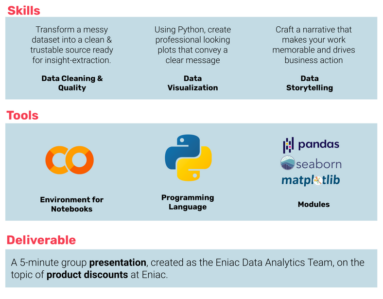

# Analyse Business Data with Pandas
Perform EDA with Python-Pandas to solve Business Questions

## Use Case
Using internal sales data on products being offered and placed orders from an e-commerce tech comppany we have to contribute to the business question whether or not it's beneficial to discount products. The data includes placed orders from 2017 until March 2018. 
The data appears to have some inconsistencies — it must have been corrupted. So it has to be inspected, evaluated and cleaned carefully before analysis. But time is running. The company board does not have time to lose and wants business insights as soon as possible.  

## Goal 
To contribute to the stratetic decision on discounting we have to get answers on some more specific aspects: 
- How products should be classified into different categories to simplify reports and analysis.
      
      How do product categories differ in terms of revenue, popularity through time etc. 
      
- Are there any seasonal patterns (holidays, weekend, special days...) detectable? 
- What is the distribution of product prices across different categories.
- How many products are being discounted.
- How big are the offered discounts as a percentage of the product prices.
- How seasonality and special dates (Christmas, Black Friday) affect sales.
- How data collection could be improved. 
- Provdie a discount strategy: 

      Analyse what has happened when discounts have been given.
      Are there differences in revenue based on the size of discount
      Predict what will happen if more discounts are given

## Skills/Tools

.

## Basic Steps in this Project: 
1. Perform data cleaning and data quality processing
3. Merge tables to generate a dataset for data analysis
4. perform explorative data analysis techniques to answer the business questionns
5. Use data visualization techniques to convey the message
6. Prepare a presentation together with the Data Analytics team for the company bord

## Files in this repository: 

